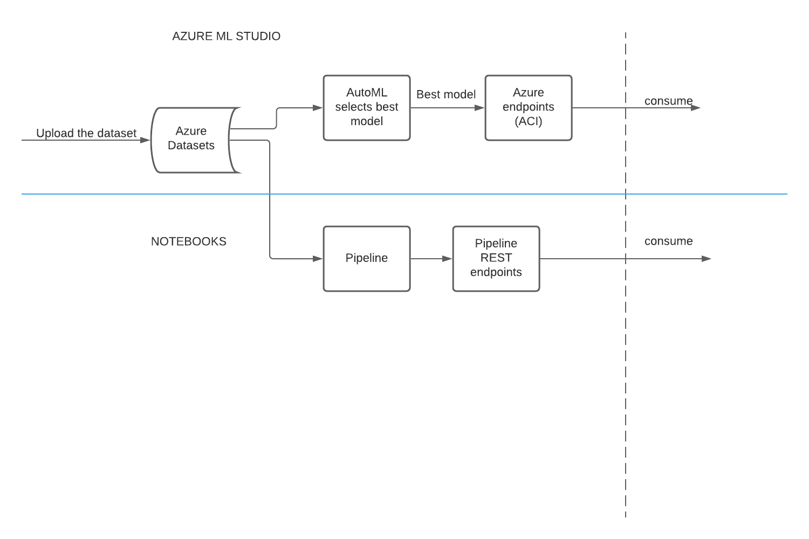

# Project 2: Operationalizing Machine Learning

## Project Overview
The goal of the project was to build, deploy and consume a classifier that will predict whether a bank customer will suscribe to a product or not. In the process, I learnt about deploying models, consuming endpoints and building pipelines.

## Architectural Diagram

## How to improve the project in the future
The project can be improved by advanced feature engineering, such as creating new features and dropping some columns.

## Screenshots

### 1. Registered Datasets

Creating the dataset using the provided URI.

### 2. Complete Experiment

The finished automl run of the experiment we created. You can  see details such as duration and best model.

### 3. Best Model

More details on the best model. You can click on view other metrics to explore the model

### 4. Application Insights Enabled

One can click on the url to view insights on the endpoint

### 5. Enabling insights using logs.py

Here we are enabling insights from local machine usig azure sdk and outputting the logs so we see what is going on.
### 6. Swagger runs on local host

Swagger allows us to see the http methods, sample inputs and expected outputs

### 7. Consuming the endpoint using endpoint.py

The model predicted no for both observations. The output is as we expected it meaning the api is healthy.

### 8. Running a benchmark
 
We get some insights(response time, etc.) from Apache about our endpoint.

### 9. Pipeline created

### 10. Pipeline Endpoint

### 11. Bank Marketing Dataset with Automl 
 Design showing the full pipeline.

### 12. Published Pipeline Overview
 It shows the  REST endpoint and the active status.

### 13. RunDetails Widget
 It indicates that the run is complete

### 14. Scheduled Run in ML Studio 
 You can see the top-most run of the pipeline-rest-endpoint is still running right from the home page of Azure ML Studio.

## ScreenCast: [YouTube link](https://youtu.be/Q0trirdPpRA)
